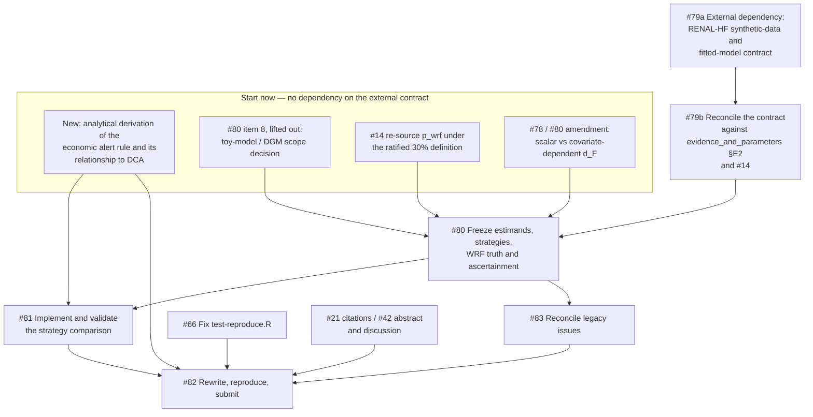

# Appraisal of issue #78 and its sub-issue tree

**Date:** 2026-09-12
**Scope:** `w-hardy/renal-hf` issues #78–#83, read against `main` at `a9f4d19`
(2026-09-11 14:51 UTC) and the open PR #86 branch
`docs/paper1-scope-reset-2026-09-11`.
**Status:** read-only review. No issue was created, edited, labelled or
commented on; no tracked file in `renal-hf` was modified.

---

## 0. Preliminary: the commissioning brief does not describe the current Paper 1

The brief for this review described Paper 1 as a methods paper arguing that
health economic modelling can derive asymmetric prediction-error weights —
weighted MAE/MSE/RMSE — with an applied CPRD Aurum case study, targeted at
*npj Digital Medicine*.

The repository is authoritative and contradicts this on four points. Recording
them here because several of the brief's section 3C gap questions are framed
around the superseded design.

| Brief | Repository | Source |
|---|---|---|
| Weighted MAE/MSE/RMSE as the object of the paper | The object is a **threshold/alert decision rule** and its NMB. `WMAE`/`WRMSE` survive only as two of eight descriptive rows in `R/stages/02_data_simulation_compute.R:100-108`, and in `archive/legacy/` | #78; `analysis_specification.md` |
| CPRD Aurum applied case study | CPRD is **deferred to future work**; the Paper 1 illustration is a synthetic dataset based on RENAL-HF development data | #78 "Paper 1 boundary"; `paper1_scope_and_programme_plan.md` §7 |
| Target *npj Digital Medicine* | Target is ***Medical Decision Making*** (D4, WH, 2026-09-04), with *Lancet Digital Health* as a ratified contingency | `governance_and_status.md`, "Target journal and its verified submission constraints"; `ROADMAP.md` §5 D4 |
| Model selection across candidate models | Model selection is **demoted to an optional bounded secondary analysis**; the primary comparison is three alert rules on one held-fixed prediction | #78 "Primary strategy comparison"; #80 item 8 |

The reset was ratified on 2026-09-11 and is recorded in
`paper1_scope_reset_2026-09-11.md`. Everything below assesses #78 against the
repository's Paper 1, not the brief's.

---

## 1. Executive summary

- **Direction: sound, and materially better than what it replaced.** #78 states
  a decision problem, separates the clinical WRF boundary from the action
  threshold, names two estimands, and fixes a boundary that excludes the
  recurrent-monitoring problem. The scope reset is the right call and the
  "Scientific invariants" list is unusually good. There is no scope creep in
  #78 itself; the risk runs the other way.
- **Direction, the one serious defect:** as specified, **both `d_S` and `d_F`
  reduce to scalar thresholds** read from `cost_of_errors.rds`. The paper's own
  Introduction argues that an economic model earns its keep only when it yields
  a *covariate-dependent* operating point "that no single elicited number can
  represent". Collapsing the fuller model to one scalar discards exactly that
  property, and with it the paper's stated reason for existing.
- **Direction, consequence:** under scalar thresholds, calibrated risk and
  homogeneous harms, `E[NMB_F(d_F)] − E[NMB_F(d_S)] ≥ 0` **by construction** —
  `d_F` is the NMB_F-maximising threshold and is graded under NMB_F. The sign
  is known before any data are seen. Only magnitude is informative, and the
  three routes to a negative sign (miscalibration, heterogeneous harms,
  Monte Carlo noise) are precisely the things no issue requires to be measured.
- **Direction: the unit of the error weight is defined; the unit of the
  *outcome* is not fully.** The weight is per-patient-per-decision, in £ at
  £25,000 and £35,000/QALY, tied to the named `bundled_alert`/`test`/`treatment`
  decisions. But `p_wrf` = 0.25 is sourced under an unknown WRF definition
  (#14, open) while the ratified definition is a 30% creatinine rise (D12). The
  reference consequence model is therefore anchored to a different event from
  the one Gate 2 will freeze as truth.
- **Decomposition: the dependency order is right, but the tree does not exist.**
  The GitHub sub-issue endpoint returns empty for #78; `has_children` is
  `false` on #78 and `has_parent` is `false` on #79–#83. Parentage is body
  prose only (`Parent: #78`). #78's completion condition and #83's acceptance
  criterion both refer to a list #78 does not contain.
- **Decomposition: circularity is handled well.** Derivation and evaluation
  layers are kept distinct (#78 invariants; #80 item 5; #81 validation list),
  rules are frozen before PSA grading, and #81 requires a test that no primary
  rule sees its evaluation draw before acting. This is the thing most likely to
  have been got wrong, and it was got right. One line, then moving on.
- **Decomposition: #79 is an unowned external dependency gating the whole
  critical path.** Every one of its eight acceptance criteria depends on
  material from a third party; it has no assignee, no date, no fallback, no
  minimum viable subset, and it does not use the repository's own
  `External dependency:` title convention. It also asks for information the
  repository already partly holds (`evidence_and_parameters.md` §E2).
- **Decomposition: #80 is an epic** — eight ratifications and nine acceptance
  criteria, of which the toy-model/DGM scope decision (item 8) depends on
  nothing in #79 and can be settled now, in parallel.
- **Gaps: the reset deletes more methodological rigour than it replaces.**
  `manuscript/_sections/02b-applied-study-designs.qmd` already specifies
  MICE-inside-resampling, flexible calibration curves with slope and intercept,
  treat-all/treat-none and the full decision curve, bootstrap optimism with
  every data-driven step inside the loop, and TRIPOD+AI reporting. #82 removes
  `02b` from the narrative and **no gate issue carries any of it forward** to
  the synthetic case.
- **Three highest-priority changes:** (1) require at least one of `d_S`/`d_F`
  to be covariate-dependent, or narrow the claim in writing; (2) make
  calibration of `P(WRF within H | history)` and the treat-all/treat-none/
  decision-curve comparators *mandatory* acceptance criteria in #80 and #81;
  (3) split #79 into the external ask and a repo-side reconciliation, and take
  #80's item 8 and the missing analytical-derivation issue off the critical
  path immediately.

---

## 2. Issue-by-issue

Deliverable and acceptance criteria are as *stated* in each issue. "Closeable
artefact" asks whether closing the issue produces one identifiable thing.

| # | Exact title | Deliverable | Closeable artefact | Acceptance criteria present | Blocking dependencies | Verdict |
|---|---|---|---|---|---|---|
| 78 | Paper 1 parent: economic decision rules for RENAL-HF trajectory predictions | Thesis, strategy set, estimands, boundary, invariants, gate structure | N — parent, by design | N — a completion condition, not criteria | None | **Rescope** — add the missing task list and sub-issue links; fix the scalar-threshold defect; state the a priori sign of the regret estimand |
| 79 | Paper 1 Gate 1: freeze the synthetic-data and fitted RENAL-HF model contract | A documented data/model contract: provenance, schema, preprocessing, prediction output, current alert rule, outcome ascertainment | Y — one contract document | Y — 8 checkboxes, all testable | External: RENAL-HF team / "Dave". No repo-side dependency | **Split** — into `External dependency:` (the ask) and a repo-side reconciliation against `evidence_and_parameters.md` §E2; add a fallback and a minimum viable subset |
| 80 | Paper 1 Gate 2: freeze estimands, alert strategies and the minimal methodological comparison | Eight frozen design ratifications | N — it is four separable freezes | Y — 9 checkboxes | #79 for items 1–4, 6; **nothing** for item 8 | **Split** — lift item 8 (toy-model/DGM scope) out now; consider separating outcome-truth/ascertainment from strategy definition |
| 81 | Paper 1 Gate 3: implement and validate the RENAL-HF alert-strategy comparison | Two or three artefacts + a validation battery | Y — the artefact set | Y — 9 checkboxes, plus an 11-point validation list | #79, #80 | **Keep** — add calibration and the treat-all/treat-none/decision-curve comparators to the required evaluation; state how artefacts enter `reproduce.R` |
| 82 | Paper 1 Gate 4: rewrite, reproduce and prepare the scoped methods paper for submission | Rewritten manuscript + reproduction + reporting sign-off | Y — a submission-ready manuscript | Y — 8 checkboxes | #79, #80, #81 | **Rescope** — name the checklists rather than gesturing at them; carry the D4 positioning judgement and the D4 dichotomisation justification as closure conditions; absorb #21 and #42 explicitly |
| 83 | Decision: review legacy Paper 1 obligations against the 2026-09-11 scope reset | A disposition for every open pre-reset stream-1 issue | Y — the disposition record | Y — 5 checkboxes | #80 (deliberately) | **Rescope** — its initial disposition names #58 and #59, both closed 2026-09-11 14:51 UTC, ~66 minutes before #83 was created; and omits #19, #21, #25 and #42 |

### Notes behind the verdicts

**#78.** The body states "Child issues are created for these gates" and
"Close this parent only when the four child gates are complete". Neither is
machine-checkable: there is no task list and no sub-issue link. #83's
acceptance criterion "the Paper 1 parent #78 lists only genuine submission
blockers after reconciliation" has no referent to act on.

The "Scientific invariants" block is the strongest part of the issue set. Five
of the eight are the exact failure modes this design invites, and they are
written as prohibitions rather than aspirations. No change needed there.

**#79.** Two specific problems beyond the ownership one.

First, it asks the RENAL-HF team for information the repository already holds
in part. `analysis/monitoring_cost_of_errors/docs/evidence_and_parameters.md`
§E2 ("What the published NephroTrend protocol settles", added 2026-08-04)
records, from the published protocol: the prediction target and 12-month
rolling horizon; that the **model output is an empirical CDF for WRF, i.e. a
probability** (which answers most of #79 item 3, and materially de-risks Gate
2's "if only point trajectories are available" branch); that the planned
evaluation is decision curve analysis with `NB = TP/N − (FP/N)·p_t/(1−p_t)`;
and a **clinically pre-specified threshold range of 10–30%**, which is a strong
candidate for `d_C` under #79 item 4. #79 cites five documents and not this
one. Its instruction "do not infer production-model details from the protocol
when the actual implementation can be obtained" is right, but it should be
paired with "reconcile against §E2 and report the differences", not with
silence.

Second, #79's claims boundary is well drawn ("cannot be presented as
independent validation") but it does not ask the **governance** question. If
the synthetic data are derived from CPRD Aurum development data, the
derivation may carry CPRD re-use conditions. #79 asks only "whether the
synthetic data or generation code may be shared with the paper" — a permission
question, not an approvals question. See the gap register.

**#80.** Item 8 (toy-model/DGM) is a scope decision about what the paper needs
to argue. It depends on the thesis, not on the delivered data contract, and
holding it behind #79 is pure serialisation. Items 1–4 and 6 genuinely need
#79. Item 5 (nesting) needs only the audited model, which exists.

Item 5 is well specified and worth saying so: "Shared pathways must use shared
parameter values/evidence where they overlap; simplification must not be
created by arbitrary parameter differences" forecloses the obvious way to
manufacture a regret result.

**#81.** The validation list is the best-specified part of the tree — eleven
checks, each falsifiable, including single-patient traceability and the
derivation/evaluation separation. Two omissions, both consequential, are in
the gap register (calibration; reference comparators).

One quieter issue: "Register/fingerprint outputs according to existing
repository conventions **only when their role is stable**" weakens a convention
the repository otherwise enforces hard (content-addressed fingerprints,
`reproduce.R`, a documented run record). Combined with "Prefer a small number
of transparent artifacts rather than another broad Stage-03-style pipeline",
the new results can legitimately sit outside the reproducible route, and no
issue says how they get back into it.

**#82.** "Complete the reporting checklists appropriate to the actual claims
(rather than legacy planned studies)" names no checklist and assigns the
choice to nobody. The repo-level gate in `governance_and_status.md` names four
(TRIPOD+AI, PROBAST+AI, CHEERS 2022, CHEERS-AI). Under the reset the paper
evaluates a third party's fitted model on synthetic data, which changes which
apply and how — a decision, not a formality.

Two ratified obligations that bind at submission are absent from #82's
criteria, both from D4: the **positioning judgement** (whether the paper reads
as presenting an individual-level prediction tool, which triggers MDM's
conditional independent-dataset validation requirement — WH owes this before
submission), and the **dichotomisation justification** (MDM requires explicit
justification wherever a continuous variable is dichotomised; the action
threshold is exactly that, and the cost-of-errors derivation is the
justification and must be stated).

**#83.** The reconciliation is the right instrument and the four-way
classification is good. Two defects. Its "Initial disposition to verify" names
"#58/#59/#66 and other genuine data/reproducibility defects" — #58 and #59 were
closed as completed at 2026-09-11 14:51:32/33 UTC by PR #70, about 66 minutes
before #83 was created at 15:57:07 UTC. And four open pre-reset stream-1
issues get no disposition at all:

- **#19** "External dependency: W8 AVP weighted-metrics pilot — the cheapest
  test of the paper's central claim, and the scope condition W9 owes". This is
  the closest existing work to the new Gates 1 and 3: it applies the audited
  `p_t` to the **actual** NephroTrend model on real data, and
  `weighted_metrics_pilot_brief.md` already specifies the comparison, the
  bootstrap rank stability, treat-all/treat-none, and calibration. It is either
  a partial substitute for Gate 3 or a direct input to it. Omitting it is the
  most consequential hole in #83.
- **#42** "Maintenance: the Discussion and the Abstract are unwritten" — #82
  rewrites both; the relationship needs stating.
- **#21** "External dependency: the citation and verification markers in the
  manuscript, and the unticked sign-off checklist" — #82's "resolve active
  citation/placeholders" is the same work.
- **#25** "Maintenance: promote the general project-owned skills to the
  w-hardy/skills fork" — genuine maintenance, class 4, but unclassified.

---

## 3. Gap register

Assessed against the **post-reset Paper 1** (synthetic RENAL-HF illustration,
one landmark per patient, three alert strategies). "Repo" records whether the
repository already holds the item somewhere; "Issues" records whether #78–#83
require it. The distinction matters: several items are regressions, not
absences.

| Item | Verdict | Repo | Issues | Why it matters |
|---|---|---|---|---|
| Split design and leakage control | **Partial** | 70/30 random split in the simulation (`02-methods.qmd:11`); off-stream selection with paired differences after the #56 Tier-A port | #79 asks whether outcomes are generated from the fitted model — the right leakage question; #81 requires no rule to see its evaluation PSA draw | Temporal/geographic splitting is moot on synthetic data, but nothing controls leakage at the **threshold-estimation** layer. `d_S`/`d_F` thresholds are external to the data (good, and #81 should say so explicitly as `02b` does). Any data-derived element — an empirical CDF, a recalibration, the landmark eligibility rule — is uncovered |
| Repeated measures and clustering within patient | **Partial** | — | #80 defaults to "one eligible prediction landmark per patient", which removes within-patient clustering **by design** and says so | Correctly handled at patient level. But #79's schema names **organisation identifiers**, and no issue addresses clustering by practice/organisation — no clustered resampling, no cluster-robust interval. With one landmark per patient this affects uncertainty, not point estimates, but #81 reports paired uncertainty and MCSE as if rows were independent |
| Missing data strategy, imputation inside resampling | **Absent (regression)** | `02b` §"Predictors, missing data, and precision": MICE, imputation models fitted **inside each resampling fold**, outcome included, m set from the proportion of incomplete cases, complete-case as prespecified sensitivity, missingness indicators for discretionary tests retained as predictors | #79 asks for "missing-value conventions" in the dictionary; #80 covers irregular **outcome** follow-up and interval censoring. **No issue requires a predictor missing-data strategy, a mechanism statement, or imputation inside resampling** | If the fitted RENAL-HF model is applied as a sealed box its own preprocessing absorbs this, and #79 item 2 partly covers it. If any refitting or recalibration happens, the `02b` standard is the one to meet and nothing says so. The mechanism statement (MAR vs MNAR for discretionary creatinine testing — testing frequency is simultaneously predictor, ascertainment determinant and plausible inequity mediator, as `02b` itself notes) is absent |
| Calibration of continuous predictions, not error magnitude alone | **Partial, effectively optional** | `02b` requires a flexible calibration curve with slope and intercept, targeting moderate calibration in the Van Calster hierarchy, and explicitly rejects Hosmer–Lemeshow. `weighted_metrics_pilot_brief.md` §2(c): miscalibration "is the most likely mechanism by which rankings diverge" | #80 lists "calibration/discrimination or trajectory error as supporting prediction metrics" among items to "prespecify only those needed"; #81 defers to #80 | **The highest-value gap.** NMB at a fixed threshold depends on absolute predicted risk being right; AUC does not. If `P(WRF within H \| history)` is miscalibrated, `d_S` and `d_F` are applied to a risk scale that does not mean what the economic model assumes, and both estimands are biased by an unmeasured amount. It is also the only route by which the regret estimand can take a sign that is not already known |
| Comparison against clinically used baselines | **Absent (regression)** | `02b`: "Treat-all and treat-none, and the full decision curve across threshold probabilities, are reported as comparators". Pilot brief: "a model that fails to beat treat-all at the relevant threshold is itself a result" | Only `d_C`, `d_S`, `d_F`. No treat-all, no treat-none, no LOCF/last-creatinine/linear-trend statistical baseline | Without treat-all and treat-none the reader cannot tell whether any strategy beats the trivial policies. This is acute here: the repository's own headline stage-03 result is that at `p_t` = 0.000690 every cost-aware arm "acts on essentially the whole cohort" — i.e. degenerates to treat-all. A design that cannot detect that degeneracy will report it as a result |
| Decision-curve / net benefit analysis | **Partial** | `02b` requires the full decision curve; #30 discharged, with decision-curve NB defined beside NMB in the Methods; the two are correctly distinguished throughout | #78–#82 are framed wholly on NMB. No issue requires a decision curve | #82 keeps the Introduction's claim that "DCA/threshold probability already represents an exchange rate in simple binary decisions" and that the HE model earns its keep beyond that. No issue requires the analysis that demonstrates the departure. The argument is asserted in the Introduction and never evidenced |
| Sensitivity to economic parameters | **Covered** | Audited PSA, 5,000 draws, seed 20260803; `cost_of_errors_draws.rds` carries per-draw harms and thresholds with a `valid` flag; SA4 discharged | #80 item 7 freezes rules before PSA grading; #81 requires stochastic and economic parameter uncertainty to be separated | Sound. One line, moving on |
| Threshold transportability | **Absent, deliberately** | #46 (SA7), scheduled under D14 | Explicitly out of scope (#78 boundary; plan §7) | Legitimate deferral, but it bounds the claim: the paper can report the value of economic information **in this setting** and must not generalise the operating point. #82's Discussion boundary list should name this alongside the others, and does not |
| External or temporal validation | **Absent, deliberately — with one unhandled consequence** | #79's claims boundary is explicit and correct | MIMIC/CPRD removed as prerequisites | Correct for a methods paper. But D4 records that MDM conditionally requires independent-dataset validation *if the paper is read as presenting an individual-level prediction tool*, and that the positioning judgement is owed by WH before submission. #82 does not carry it |
| TRIPOD+AI reporting items | **Partial** | Named in `governance_and_status.md` pre-submission gates; `02b` states "Reporting follows TRIPOD+AI"; PROBAST+AI named in the Study 2 prespecification | #82: "complete the reporting checklists appropriate to the actual claims" — no checklist named, no owner | TRIPOD+AI covers evaluation, not only development, so it still applies to a paper evaluating a third party's fitted model. Two items are live and unaddressed anywhere: **item 18 (open science)** — a reader cannot reconstruct a model held by a collaborator, which must be stated rather than left implicit; and **item 19 (PPI)** — if none, TRIPOD+AI requires saying so. The `02b` deletion also removes the only place fairness reporting is specified |
| CPRD data governance and approvals | **Absent — correctly for CPRD, incorrectly for the synthetic data** | `data_governance_mimic.md` exists; there is **no CPRD governance document**; `ROADMAP.md` §8 P4 "CPRD application requirements" is an unrun prompt; `admin/protocol/` and `admin/proposal/` contain only `.gitkeep` | CPRD is out of scope. #79 asks only whether the synthetic data "may be shared with the paper" | The synthetic dataset is described as "based on the data used to develop the RENAL-HF algorithm", which is CPRD Aurum. Synthetic derivation does not automatically discharge CPRD re-use conditions. #79 should ask for the approval reference under which the synthesis was produced and the terms on which a derived dataset may be published, not just for permission |
| Computational reproducibility | **Covered at repo level, partial at issue level** | `renv.lock` pinned with path-triggered CI `renv::restore()` validation (D21); `reproduce.R` with content-addressed stage fingerprints; `sessionInfo.txt`; a dated run record; L'Ecuyer-CMRG streams and MCSE columns in stage 03 after #56 | #81 fingerprints "only when their role is stable"; #82 requires "full relevant reproduction/tests pass and are recorded" | The repository's reproducibility is a genuine strength. The risk is the new work being allowed to sit outside it. Also live: **#66**, a reproducibility defect that "fails whenever Quarto is on PATH" — on #82's critical path, correctly named in #83 |

### Two gaps not in the brief's list, both material

**The reference consequence model is anchored to a different event from the one
Gate 2 will freeze.** `p_wrf` = 0.25 is Lawson 2018-sourced; the repository
records that Lawson's own WRF definition is unknown
(`sources.csv` gives "UK CPRD anchor for WRF ~26%", no threshold), while the
ratified project definition is a **30% creatinine rise** (D12, #14 open). The
direction of effect is recorded: a stricter 30% threshold defines fewer, more
severe events, so `p_wrf` moves **downward** by an unestablished amount.
`p_wrf` propagates into the harm ratio and therefore into `p_t` — the object of
both primary estimands. #78's invariant "Do not alter the clinical WRF
definition to improve an economic comparison" is correct but one-directional;
the matching requirement — that the reference model be anchored to the frozen
WRF definition — is stated nowhere. #83 defers this under "distinguish
requirements for using the audited model as a methodological reference
consequence model from requirements for making literal clinical/economic
claims". That distinction is right for *most* parameters. It does not hold for
`p_wrf`, because a reference model that prices a different event is not a valid
grader even for a purely methodological comparison of rules targeting the
frozen event.

**Neither the analytical derivation nor the toy models have an issue.**
`paper1_scope_and_programme_plan.md` §3 lists five evidence components for
Paper 1: a formal/analytical derivation linking HE consequences to the alert
operating point; the synthetic dataset; the fitted model; simple toy models;
and a tiny controlled DGM if needed. #79–#82 cover components two, three and
(optionally) five. **Components one and four appear in no issue.** #82 retains in
the Introduction the argument a derivation would establish — that
"DCA/threshold probability already represents an exchange rate in simple binary
decisions" and that "an explicit HE model can derive those consequences where
pathways are richer/heterogeneous/long-term" — but neither #82's Methods list
nor any other issue requires the derivation itself. And #78's
instruction "Do not create additional Paper 1 work packages unless a child
issue identifies a concrete blocker" actively prevents creating the issue the
plan requires.

---

## 4. Recommended restructure

### What to do first — ordered

1. **Fix the tree mechanically** (minutes, no science). Link #79–#83 as
   sub-issues of #78; add the task list to #78; retitle #79 to the
   repository's `External dependency:` convention.
2. **Take three things off the critical path now**, all of which depend on
   nothing in #79:
   - #80 item 8 — the toy-model/DGM scope decision;
   - a new issue for the **analytical derivation** (plan §3 component 1);
   - **#14** — re-source `p_wrf` under the ratified 30% definition. This is
     already open and already an external ask; promoting it to a Paper 1
     blocker costs nothing and removes a defect in the grader.
3. **Split #79** into 79a (the external ask, owned, dated, with a minimum
   viable subset and a stated fallback) and 79b (reconcile the delivered
   contract against `evidence_and_parameters.md` §E2 and #14, and report
   differences). 79b can start before 79a returns, because §E2 exists now.
4. **Amend #78 and #80 for the covariate-dependence defect** before Gate 2
   freezes anything. Either `d_F` becomes covariate-dependent, or #78 states in
   writing that Paper 1 tests the scalar case only and narrows the
   Introduction's claim accordingly. This is a decision, not an analysis, and
   it determines what Gate 3 builds.
5. **Amend #80 and #81 for the evaluation gaps** — calibration as a mandatory
   criterion; treat-all, treat-none and the decision curve as required
   comparators; a predictor missing-data statement.
6. Then #81, then #82, with **#83 after #80** as currently specified.

### Dependency graph

### What can run in parallel

- **Four workstreams before the contract lands:** the analytical derivation;
  the toy-model scope decision; #14; and the scalar-vs-covariate-dependent
  ruling. None touches the synthetic data.
- **During #79a's wait:** #66 (reproducibility defect), #21 (citation markers)
  and the #82 checklist-selection decision are all independent of the data
  contract.
- **Within #80:** the WRF truth and ascertainment freeze (items 3, and the
  follow-up/censoring criterion) is separable from the strategy definition
  (item 4) and the nesting definition (item 5). Item 5 needs only the audited
  model and can be settled in parallel with items 1–4.
- **Not parallelisable, correctly:** #81 after #80, and #82 after #81. The
  serialisation there is real.

---

## 5. Proposed issue text

Ready to paste. **Not created.** Redlines use ~~strikethrough~~ for deletions
and **bold** for insertions.

### 5.1 New issue — analytical derivation (plan §3 component 1)

> **Title:** `Paper 1: derive the economic alert rule analytically and locate it against decision curve analysis`
>
> Parent: #78
> Depends on: nothing — this can start immediately.
>
> ## Purpose
>
> Produce the formal derivation that
> `analysis/nephrotrend_accuracy_metrics/docs/paper1_scope_and_programme_plan.md`
> §3 lists as the first of Paper 1's five evidence components, and that #82's
> Introduction asserts without evidencing. No current issue owns it.
>
> ## What to derive
>
> 1. From a consequence model with harms `h_FN` and `h_FP`, the alert rule that
>    maximises expected NMB when acting on `P(WRF within H | history)`, and the
>    operating point it implies.
> 2. The exact conditions under which that rule coincides with a decision-curve
>    threshold probability `p_t`, and therefore the conditions under which the
>    economic derivation adds nothing beyond DCA. State them as conditions, not
>    caveats.
> 3. The conditions under which it does **not** coincide — long-term,
>    discounted, multi-pathway or heterogeneous consequences — and in particular
>    whether the resulting operating point is covariate-dependent.
> 4. Whether `E[NMB_F(d_F)] − E[NMB_F(d_S)] ≥ 0` holds by construction under the
>    Paper 1 design, and under exactly which assumptions it can be violated
>    (candidates: miscalibration of the predicted risk; covariate-dependent
>    harms graded by a scalar rule; Monte Carlo error). This determines what the
>    regret estimand can and cannot establish, and must be settled before Gate 3
>    runs.
>
> ## Why it is on the critical path
>
> The Introduction (`manuscript/_sections/01-introduction.qmd`) already asserts
> that the health economic harm ratio "reduces
> to exactly the exchange rate `p_t/(1−p_t)` that decision curve analysis
> already encodes" for a single decision in a homogeneous population, and that
> the value appears only when the consequence structure is richer. That
> assertion is currently unevidenced in the paper's own analysis. It is also the
> premise on which the choice between a scalar and a covariate-dependent `d_F`
> turns.
>
> ## Acceptance criteria
>
> - [ ] the optimal alert rule is derived from a stated consequence model;
> - [ ] the DCA-equivalence conditions are stated exactly;
> - [ ] the conditions for a covariate-dependent operating point are stated;
> - [ ] the a priori sign of each primary estimand is established, with the
>       assumptions under which it can be violated;
> - [ ] the result is written in a form the Methods can carry without rederivation.

### 5.2 New issue — CPRD-derived synthetic data governance

> **Title:** `External dependency: governance terms for the CPRD-derived RENAL-HF synthetic dataset`
>
> Parent: #78
> Related: #79
>
> ## Purpose
>
> #79 asks whether the synthetic data "may be shared with the paper". That is a
> permission question. This issue asks the approvals question, which is
> separate and is not answered anywhere in the repository.
>
> The synthetic dataset is described as based on the data used to develop the
> RENAL-HF algorithm, which is CPRD Aurum. Synthetic derivation does not by
> itself discharge CPRD's conditions on derived data.
>
> ## Required
>
> 1. the CPRD protocol/ISAC (or successor RDG) reference under which the
>    development data were held, and whether the synthesis falls inside it;
> 2. the terms on which a derived or synthetic dataset may be published,
>    deposited or shared with a journal;
> 3. whether generation code may be shared where the data may not;
> 4. any linked-data (e.g. HES, IMD, ONS) conditions that survive into the
>    synthetic derivative;
> 5. the acknowledgement and disclaimer wording CPRD requires;
> 6. whether the fitted RENAL-HF model itself carries conditions on publication
>    of its outputs.
>
> ## Why it matters
>
> The repository has `docs/data_governance_mimic.md` and no CPRD equivalent;
> `ROADMAP.md` §8 P4 ("CPRD application requirements") has not been run.
> TRIPOD+AI item 18 requires a data-availability statement, and #82 cannot
> honestly complete one without this.
>
> ## Acceptance criteria
>
> - [ ] the governing approval and its scope are identified;
> - [ ] publishable/non-publishable artefacts are listed explicitly;
> - [ ] required acknowledgement and disclaimer wording is recorded;
> - [ ] a data-availability statement that is true can be written for #82;
> - [ ] any restriction that changes what Gate 3 may output is flagged to #81.

### 5.3 Redline — #78 "Primary strategy comparison"

> The intended primary strategy set is:
>
> - `d_C`: current/conventional RENAL-HF alert rule — exact definition must be
>   obtained from the RENAL-HF team rather than invented;
> - `d_S`: alert rule derived from a deliberately simple, transparent HE
>   consequence model;
> - `d_F`: alert rule derived from the fuller audited/reference HE consequence
>   model.
>
> **`d_F` must retain the property that distinguishes the fuller model. If the
> fuller model yields a covariate-dependent operating point, `d_F` is that rule
> and not a scalar summary of it. Collapsing `d_F` to a single threshold read
> from `cost_of_errors.rds` discards the only feature that makes the fuller
> model worth building, and reduces the simplification-regret estimand to the
> difference between two numbers. If Gate 2 rules that Paper 1 tests the scalar
> case only, that ruling must be recorded here and the Introduction's claim
> about covariate-dependent operating points narrowed to match.**
>
> **Two reference comparators are reported alongside the three strategies:
> treat-all and treat-none. A strategy that does not beat treat-all at the
> derived operating point is a result and is reported as one.**
>
> All three must be evaluated under the same fuller reference consequence model.
>
> Primary estimands:
>
> - value of introducing economic information: `E[NMB_F(d_S)] - E[NMB_F(d_C)]`;
> - regret from economic-model simplification: `E[NMB_F(d_F)] - E[NMB_F(d_S)]`.
>
> **The second estimand is non-negative by construction where the predicted risk
> is calibrated, the harms are homogeneous and both rules are scalar thresholds:
> `d_F` maximises `NMB_F` and is graded under `NMB_F`. Its magnitude is
> informative; its sign is not. The paper must say so, and must report the
> calibration evidence that determines whether the construction holds.**
>
> **The first estimand confounds two differences where `d_C` acts on a different
> information set from `d_S` — the information set and the placement of the
> threshold. Where `d_C` is not a threshold on the same predicted risk, report
> the decomposition, or an intermediate rule that uses `d_C`'s information set
> at the economically derived operating point, rather than attributing the whole
> difference to "economic information".**

### 5.4 Redline — #80 acceptance criteria

> - [ ] one-index-decision primary design is accepted or an alternative is
>       explicitly justified;
> - [ ] common prediction quantity and WRF truth are frozen;
> - [ ] **the reference consequence model's `p_wrf` is anchored to the same WRF
>       definition that is frozen as truth, or the mismatch is quantified and
>       declared (see #14: `p_wrf` = 0.25 is sourced under an unknown
>       definition; the ratified definition is a 30% creatinine rise, D12);**
> - [ ] `d_C`, `d_S`, `d_F` are fully specified before final comparative results;
> - [ ] **whether `d_F` is covariate-dependent or scalar is ruled explicitly,
>       with the consequence for the paper's claim recorded;**
> - [ ] simple versus full economic-model nesting is explicit and auditable;
> - [ ] primary estimands and supporting metrics are fixed;
> - [ ] **calibration of `P(WRF within H | history)` is a required output, not a
>       supporting metric: a flexible calibration curve with slope and
>       intercept, never Hosmer–Lemeshow. NMB at a fixed threshold depends on
>       absolute risk being right, so miscalibration biases both primary
>       estimands by an unmeasured amount and is the only route by which the
>       regret estimand can take a sign that is not already known;**
> - [ ] **treat-all, treat-none and the decision curve across the plausible
>       threshold range are prespecified as comparators;**
> - [ ] **the predictor missing-data strategy is stated — amount, assumed
>       mechanism, handling — and where any refitting or recalibration occurs,
>       imputation sits inside the resampling loop with the outcome in the
>       imputation model, matching the standard already specified in
>       `manuscript/_sections/02b-applied-study-designs.qmd`;**
> - [ ] **clustering by organisation identifier is either handled in the
>       uncertainty calculation or declared negligible with a reason;**
> - [ ] follow-up/censoring/unknown outcome handling is fixed;
> - [ ] strategy-freezing and uncertainty rules are fixed;
> - [ ] ~~the toy-model/DGM question is resolved with a bounded scope if
>       retained;~~ **[moved to its own issue — it depends on nothing in #79 and
>       should not be serialised behind the data contract]**
> - [ ] Gate 3 can be implemented without further researcher-level choices about
>       the primary comparison.

### 5.5 Redline — #81 "Required evaluation"

> All primary policies must be scored under the same fuller audited/reference
> consequence model. At minimum produce:
>
> - strategy alert proportion;
> - **treat-all and treat-none as scored reference strategies;**
> - WRF events ascertainable under the frozen outcome rule;
> - missed WRF / false-alert summaries where outcome status permits
>   classification;
> - expected cost;
> - expected QALYs;
> - expected NMB;
> - `E[NMB_F(d_S)] - E[NMB_F(d_C)]`;
> - `E[NMB_F(d_F)] - E[NMB_F(d_S)]`;
> - paired uncertainty / MCSE appropriate to the design;
> - **a calibration curve for `P(WRF within H | history)` with slope and
>   intercept over the ascertainable subset, reported beside the NMB results;**
> - **a decision curve over the clinically plausible threshold range, with the
>   derived operating points marked on it;**
> - supporting prediction-performance diagnostics required by #80.
>
> **Do not report accuracy, F1 or any threshold-based classification measure as
> evidence that a strategy is better: they are improper at a fixed threshold and
> a worse model can score higher.**
>
> Do not force patients with inadequate outcome follow-up into a TP/FP/FN/TN
> cell. Preserve explicit outcome-status/provenance fields so denominators are
> auditable.

And on the output contract:

> Register/fingerprint outputs according to existing repository conventions
> ~~only when their role is stable~~ **. State explicitly how the new artefacts
> enter `reproduce.R` and the repository artifact manifest, or record a
> ratified decision that they do not and why. `docs/pipeline_and_reproduction.md`
> is the governing convention; #82 cannot record a reproduction that does not
> reach these artefacts.**

### 5.6 Redline — #82 "Reproducibility and reporting"

> Before closure:
>
> - manuscript numbers must come from stable/frozen artifacts according to
>   repository convention;
> - run relevant scientific-property tests and full reproduction route needed by
>   the final paper **(note #66: `test-reproduce.R` currently fails whenever
>   Quarto is on `PATH`, and is a prerequisite)**;
> - ensure no active prose says Paper 1 requires MIMIC/CPRD or the recurrent
>   monitoring study;
> - distinguish synthetic illustration from independent validation;
> - distinguish clinical WRF threshold from economic action threshold;
> - verify the current/simple/full strategy definitions against #80;
> - preserve the reference-model versus literal-truth caveat;
> - ~~complete the reporting checklists appropriate to the actual claims (rather
>   than legacy planned studies)~~ **decide and record which checklists apply to
>   the reset paper, then complete them. TRIPOD+AI applies to model evaluation,
>   not only development, so it still binds. Two of its items need an explicit
>   answer and currently have none anywhere in the repository: item 18 (open
>   science — a reader cannot reconstruct a model held by a collaborator, which
>   must be stated, alongside a data-availability statement consistent with the
>   CPRD governance terms) and item 19 (patient and public involvement — if
>   none, say so). CHEERS 2022 applies to the consequence model as used here;
>   record whether PROBAST+AI and CHEERS-AI are in or out, with a reason;**
> - **discharge the two D4 obligations that bind at submission: the positioning
>   judgement WH owes on whether the paper reads as presenting an
>   individual-level prediction tool (which triggers MDM's conditional
>   independent-dataset validation requirement), and the explicit justification
>   MDM requires wherever a continuous variable is dichotomised — the action
>   threshold is exactly that, and the cost-of-errors derivation is the
>   justification and must be stated as such;**
> - **state in the Discussion boundary list that threshold transportability is
>   untested (#46), alongside the DCA, validation, cost-effectiveness,
>   monitoring-policy and VOI/equity boundaries already listed;**
> - resolve active citation/placeholders that remain in the scoped manuscript
>   **(#21, and #42 for the Abstract and Discussion — both are this issue's work
>   and should be linked rather than left to #83)**.

### 5.7 Redline — #83 "Initial disposition to verify"

> - #71-#77 → Paper 2 longitudinal monitoring programme; retain open, not Paper
>   1 blockers.
> - #56 and Stage-03-specific obligations (#67-#69) → retain as
>   historical/corrected machinery until #80 decides whether any of it remains
>   part of Paper 1; likely not a new prerequisite if the synthetic strategy
>   comparison replaces those headline results.
> - **#19 (W8 AVP weighted-metrics pilot) → assess as a partial substitute for,
>   or direct input to, Gates 1 and 3 rather than as legacy. It applies the
>   audited `p_t` to the actual NephroTrend model on real data, and
>   `weighted_metrics_pilot_brief.md` already specifies the comparison, the
>   bootstrap rank stability, the treat-all/treat-none references and the
>   calibration reporting that #80 and #81 currently lack. If it is retained,
>   say whether it is a Paper 1 result or a Paper 1 input; if it is dropped, say
>   what replaces the real-data check of the paper's central claim.**
> - **#14 → promote to a Paper 1 blocker. `p_wrf` anchors the reference
>   consequence model to a WRF definition that may differ from the one Gate 2
>   freezes as truth; a grader that prices a different event is not valid even
>   for a purely methodological comparison.**
> - **#21 and #42 → assign to #82; they are that issue's work, not legacy.**
> - **#25 → genuine repository maintenance (class 4), independent of manuscript
>   scope.**
> - #5/#17 and #46 → future applied validation/transportability, not Paper 1
>   prerequisites.
> - existing extended VOI work → preserve as future decision-uncertainty work,
>   not a Paper 1 prerequisite unless #80 identifies a direct need.
> - existing extended equity analysis → preserve as future equity/fairness work,
>   not a Paper 1 prerequisite.
> - ~~#58/#59/#66~~ **#66** and other genuine data/reproducibility defects →
>   retain according to whether they affect the new Paper 1 route; do not close
>   merely because manuscript scope changed. **(#58 and #59 were closed as
>   completed by PR #70 on 2026-09-11 at 14:51 UTC, about an hour before this
>   issue was opened.)**
> - #6/#8/#9/#14/#18/#20 and other economic-model evidence/sign-off dependencies
>   → distinguish requirements for using the audited model as a **methodological
>   reference consequence model** from requirements for making literal
>   clinical/economic claims about RENAL-HF. **This distinction does not extend
>   to `p_wrf` (#14): see above.**

---

## 6. Open questions

Unresolvable from the repository.

1. **Is `d_C` the protocol's 10–30% threshold range, or something else?**
   `evidence_and_parameters.md` §E2 records a clinically pre-specified 10–30%
   range from the published protocol, justified as "10% … justifies a low-cost
   blood test, while more than 30% may require a change in the medicine". #79
   asks the team for the current rule without reference to it. Whether the
   deployed rule is that range, a point within it, or a trajectory-crossing
   rule that is not a risk threshold at all, determines whether the first
   primary estimand is a threshold comparison or an
   information-set-plus-threshold comparison.
2. **Does the fitted model output a usable predictive distribution?** §E2 says
   the output is an empirical CDF for WRF, i.e. a probability. #79 asks the same
   question as if it were open. If §E2 is current, Gate 2's "if only point
   trajectories are available, document the required uncertainty model" branch
   is dead and should be closed; if §E2 is stale, that should be recorded.
3. **Will the synthetic outcome process be generated from the fitted RENAL-HF
   model?** #79 asks, correctly, and draws the claims boundary. But the answer
   also determines whether calibration can be assessed at all: if the outcome is
   generated from the model, calibration is circular and the fifth gap above
   cannot be closed on this dataset. A contingency is needed.
4. **Who owns #79, and what happens if the contract does not arrive?** The
   issue names "the RENAL-HF team / Dave" in a heading and has no assignee, no
   date and no fallback. The entire critical path sits behind it.
5. **What is the relationship between #19 and the new Gate 3?** #19 is described
   in its own title as "the cheapest test of the paper's central claim" and
   operates on the real model and real data. Whether the synthetic comparison
   supersedes it, depends on it, or reports alongside it is undecided.
6. **Which WRF definition did Lawson 2018 use?** Recorded as unknown; #14 owes
   it; it propagates into the harm ratio and therefore into both estimands.
7. **Is PR #86 intended to merge before Gate 1 starts?** #78–#83 were created
   2026-09-11 15:55–15:57 UTC and cite
   `docs/paper1_scope_and_programme_plan.md` and
   `appendices/decision_history/paper1_scope_reset_2026-09-11.md` as
   authoritative. Neither exists on `main`; both are on the open PR #86 branch
   `docs/paper1-scope-reset-2026-09-11`, opened 16:02 UTC. Anyone following
   #78's own instructions from `main` will not find the plan.
8. **Was there one AVP communication or two?** `evidence_and_parameters.md` §E2
   states this is "a one-line question for WH, not resolved by inference here".
   It does not affect the 30% definition, which both confirmations agree on.

---

## 7. What could not be accessed

- **The synthetic dataset and the fitted RENAL-HF model.** Neither is in the
  repository; both are the subject of #79.
- **The RENAL-HF/NephroTrend protocol and publication.** Vincent-paulraj et al.,
  *Eur Heart J Digit Health* 2026;7:ztag055, is cited throughout but not held
  here. Statements about its content are taken from
  `evidence_and_parameters.md` §E2 and are attributed to that record, not
  independently verified.
- **`admin/protocol/` and `admin/proposal/`** contain only `.gitkeep`. There is
  no study protocol or grant proposal in the repository.
- **Issue comments.** #78, #79, #80, #81, #82 and #83 have **no comments**, no
  labels and no assignees (checked directly on #78 and #81; `assignees` empty on
  all six). Nothing was withheld; there is nothing there.
- **Sub-issue relationships.** The GitHub sub-issues endpoint returns an empty
  array for #78, and `has_children`/`has_parent` are `false` throughout. This is
  a finding, not an access failure — the fallback to body-text task lists also
  found none, because #78 contains no task list.
- **Linked PRs.** `closed_by_pull_requests` is empty for all six issues. PR #86
  is the only open PR touching this work and is a documentation-only change
  (5 files, +745/−217).
